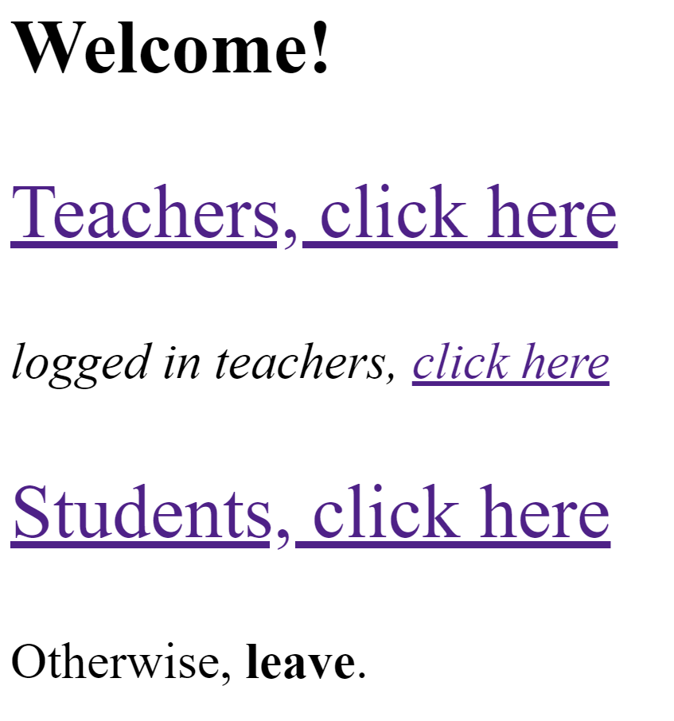
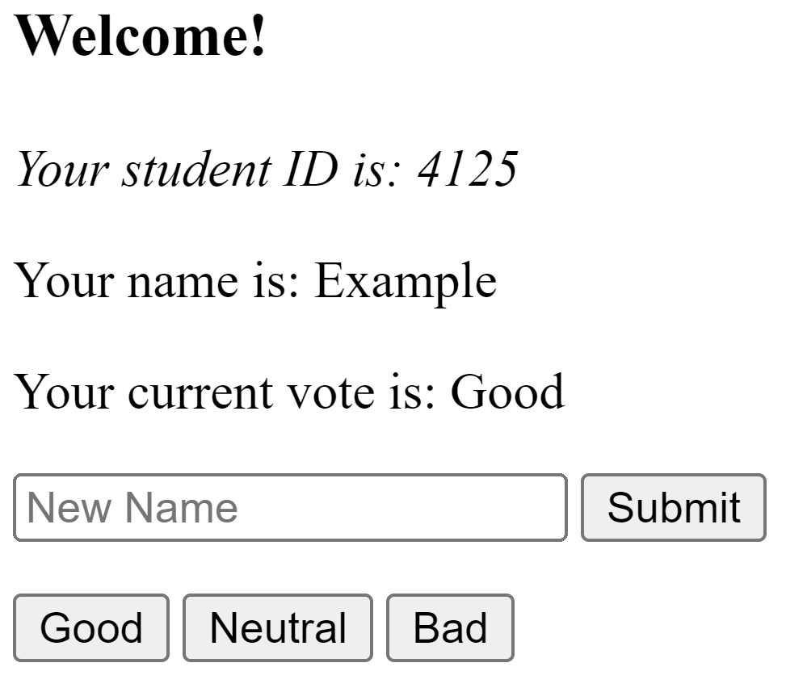
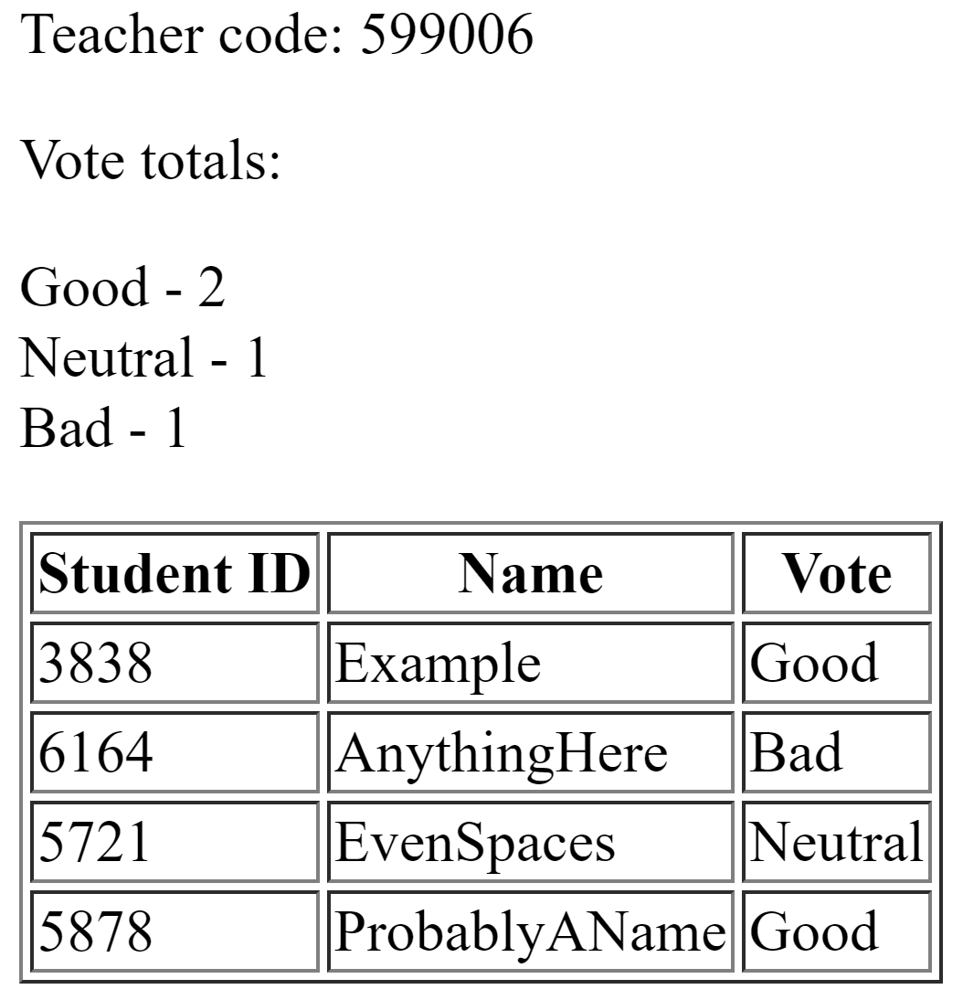
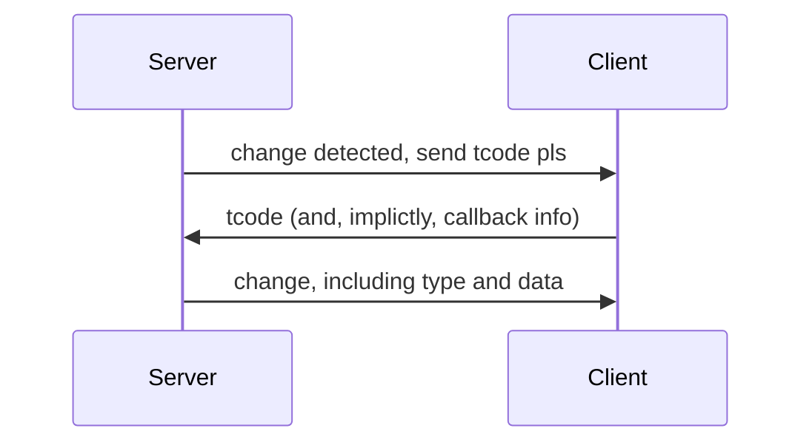

# Weird live voting system thing
## Example images from running application

## Quickstart

Only use `python app.py`; do not use `flask run`
(for compatability with flask-socketio)

## Current method for sockets live-updating data
